# Xponsor 🚀

A modern influencer-brand collaboration platform that connects brands with social media influencers through intelligent matching and secure messaging.

## 🌟 Features

### For Influencers
- **Instagram Integration**: Automatic follower count verification using Instagram's official API
- **Campaign Discovery**: Browse brand campaigns that match your follower requirements
- **Direct Messaging**: Communicate with brands through secure in-app messaging
- **Privacy Control**: Manage who can send you messages

### For Brands
- **Campaign Management**: Create and manage sponsorship campaigns with specific requirements
- **Influencer Discovery**: Browse and filter influencers based on follower count and engagement
- **Smart Matching**: Only show your campaigns to influencers who meet your criteria
- **Direct Communication**: Message qualified influencers directly

### General
- **Secure Authentication**: Google OAuth integration for safe and easy login
- **Real-time Messaging**: Instant communication between brands and influencers
- **Follower Verification**: Authentic follower counts through Instagram's official API
- **Privacy Settings**: Control message accessibility and campaign visibility

## 🛠️ Tech Stack

- **Frontend**: Next.js 15.3.2 with React 19
- **Database**: Neon (Serverless PostgreSQL)
- **Authentication**: NextAuth.js with Google OAuth
- **Social Integration**: Instagram Official API
- **Styling**: Tailwind CSS 4.1.6
- **ORM**: Prisma 6.8.0
- **HTTP Client**: Axios
- **Deployment**: Vercel

## 🚀 Live Demo

Visit the live application: [https://xponsor.vercel.app](https://xponsor.vercel.app)

## 📱 Screenshots

<div align="center">
  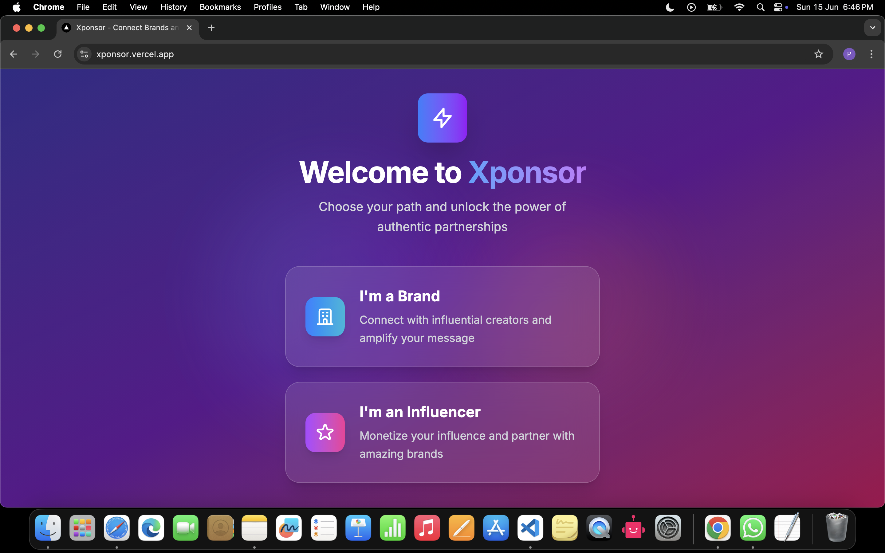
  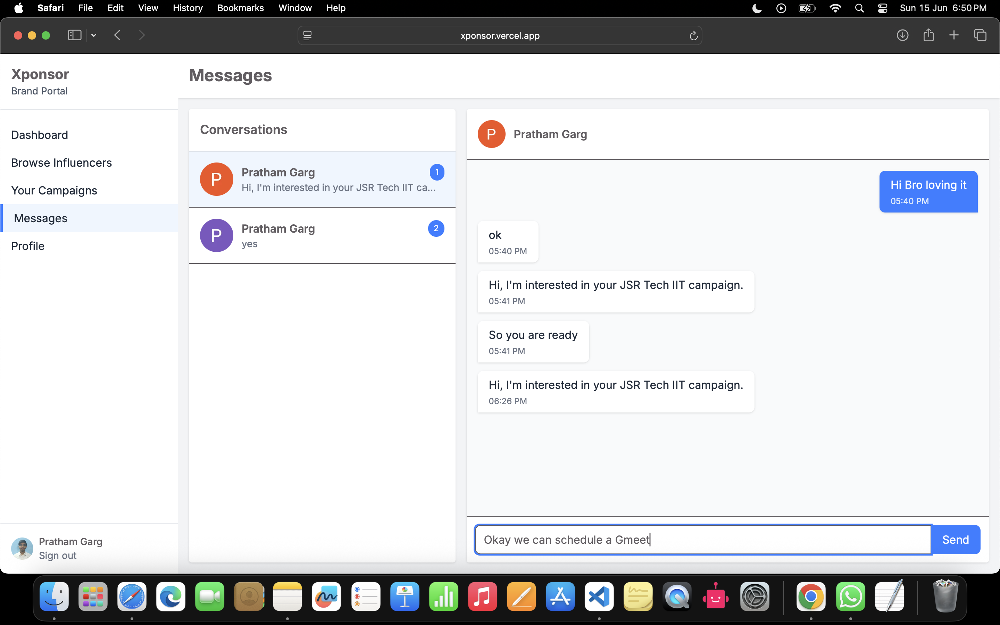
  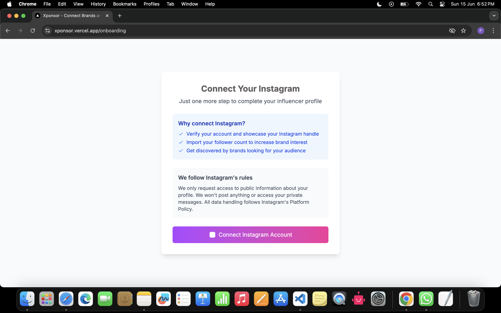
</div>

<div align="center">
  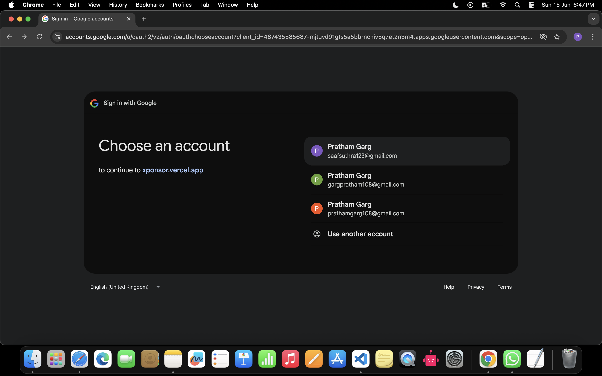
  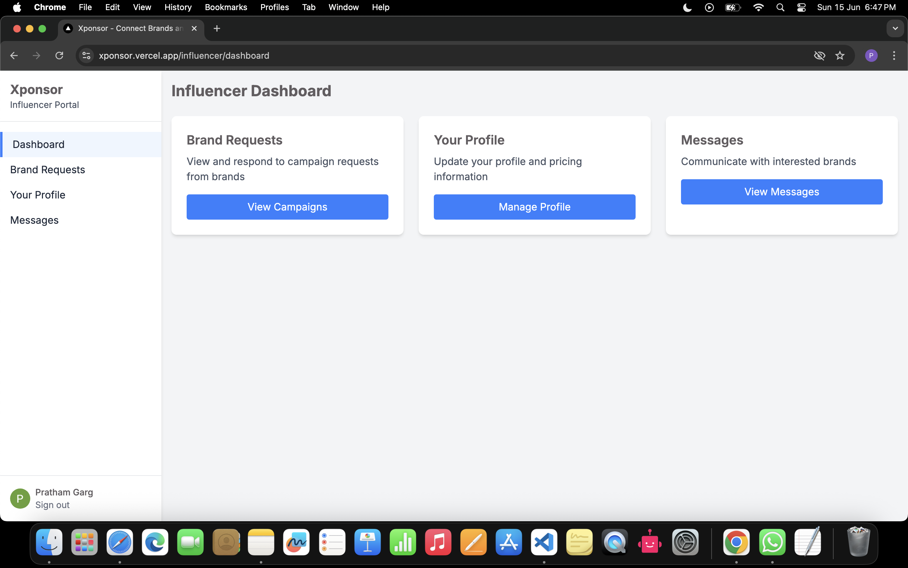
  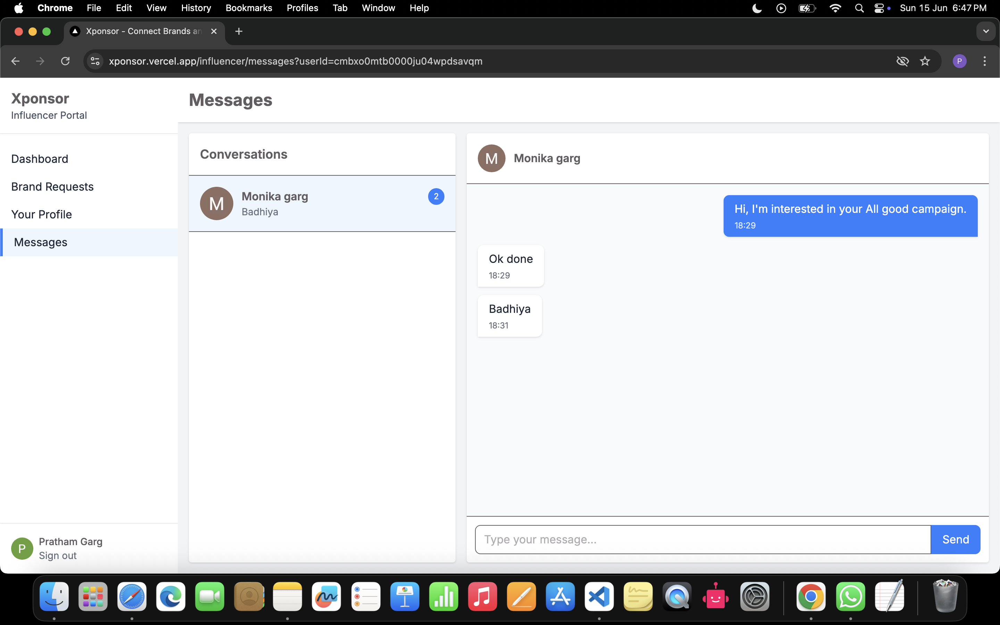
</div>

<div align="center">
  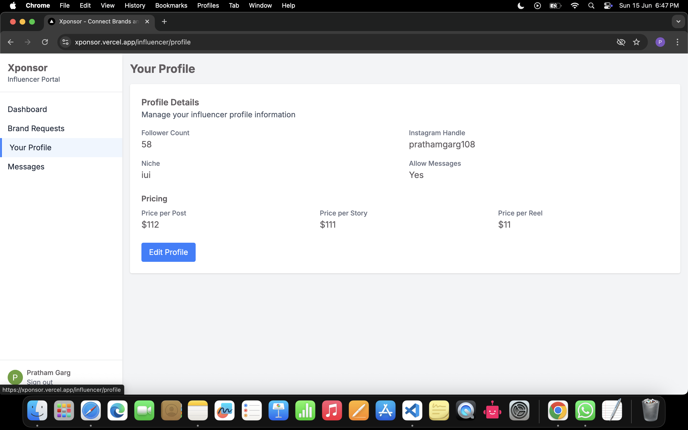
  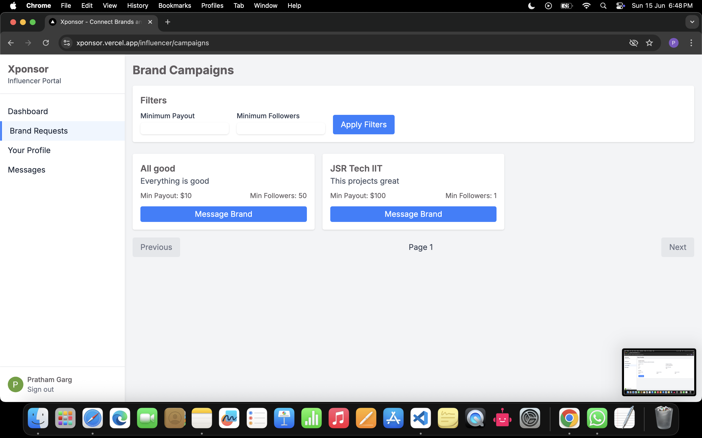
  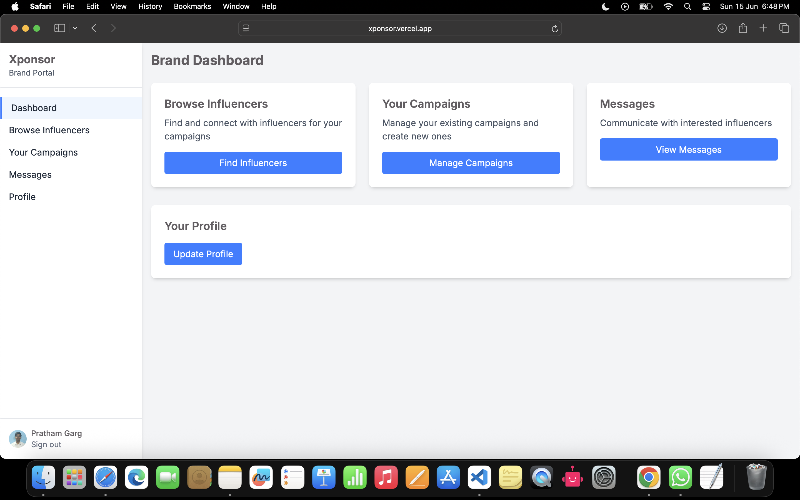
</div>

<div align="center">
  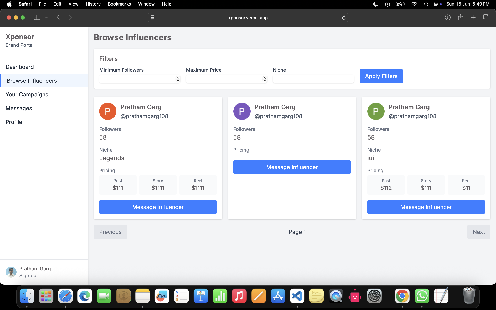
  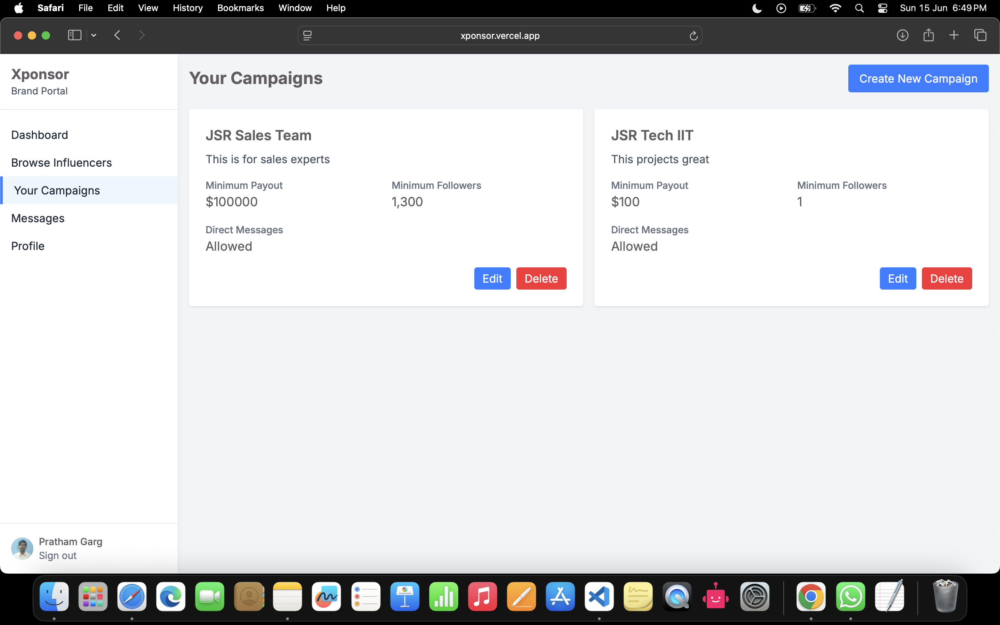
</div>

## 🏗️ Getting Started

### Prerequisites

- Node.js 18+ 
- npm or yarn
- A Neon database account
- Google OAuth credentials
- Instagram Developer Account

### Installation

1. **Clone the repository**
   ```bash
   git clone https://github.com/PrathamGarg1/Xponsor.git
   cd Xponsor
   ```

2. **Install dependencies**
   ```bash
   npm install
   ```

3. **Set up environment variables**
   Create a `.env.local` file in the root directory:
   ```env
   # Database
   DATABASE_URL="your-neon-database-url"
   
   # NextAuth
   NEXTAUTH_URL="http://localhost:3000"
   NEXTAUTH_SECRET="your-nextauth-secret"
   
   # Google OAuth
   GOOGLE_CLIENT_ID="your-google-client-id"
   GOOGLE_CLIENT_SECRET="your-google-client-secret"
   
   # Instagram API
   INSTAGRAM_CLIENT_ID="your-instagram-client-id"
   INSTAGRAM_CLIENT_SECRET="your-instagram-client-secret"
   ```

4. **Set up the database**
   ```bash
   npx prisma generate
   npx prisma db push
   ```

5. **Run the development server**
   ```bash
   npm run dev
   ```

6. **Open your browser**
   Navigate to [http://localhost:3000](http://localhost:3000)

## 🎯 How It Works

### Campaign Matching System
1. **Brands create campaigns** with specific follower count requirements
2. **System filters visibility** - only qualified influencers see relevant campaigns
3. **Influencers apply** to campaigns they're interested in
4. **Brands review applications** and initiate conversations

### Messaging System
- **Privacy-first approach**: Users control who can message them
- **Campaign-based messaging**: Messages tied to specific campaigns or general inquiries
- **Real-time notifications**: Stay updated on new messages and campaign opportunities

### Verification Process
- **Instagram integration** ensures authentic follower counts
- **No fake metrics** - all data pulled directly from Instagram's official API
- **Regular updates** to maintain accuracy

## 🔧 API Endpoints

### Authentication
- `POST /api/auth/signin` - User sign in
- `POST /api/auth/signout` - User sign out

### Campaigns
- `GET /api/campaigns` - Fetch available campaigns
- `POST /api/campaigns` - Create new campaign
- `PUT /api/campaigns/:id` - Update campaign
- `DELETE /api/campaigns/:id` - Delete campaign

### Messages
- `GET /api/messages` - Fetch user messages
- `POST /api/messages` - Send new message
- `PUT /api/messages/:id` - Mark message as read

### Instagram Integration
- `GET /api/instagram/verify` - Verify Instagram account
- `GET /api/instagram/stats` - Get follower statistics

## 🤝 Contributing

1. Fork the repository
2. Create your feature branch (`git checkout -b feature/AmazingFeature`)
3. Commit your changes (`git commit -m 'Add some AmazingFeature'`)
4. Push to the branch (`git push origin feature/AmazingFeature`)
5. Open a Pull Request

## 📄 License

This project is open source and available under the [MIT License](LICENSE).

## 👨‍💻 Developer

**Pratham Garg** - [@PrathamGarg1](https://github.com/PrathamGarg1)

## 🙏 Acknowledgments

- Instagram for their robust API
- Neon for serverless database solutions
- Vercel for seamless deployment
- Next.js team for the amazing framework

---

<div align="center">
  <p>Made with ❤️ for the creator economy</p>
  <p>
    <a href="https://xponsor.vercel.app">🌐 Live Demo</a> •
    <a href="#-features">✨ Features</a> •
    <a href="#-getting-started">🚀 Setup</a> •
    <a href="#-contributing">🤝 Contribute</a>
  </p>
</div>
